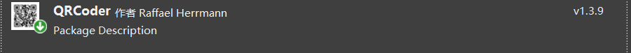

# 生成二维码

### 一、安装Nuget包

#### 1、创建一个BaseController



### 二、创建QrCodeHelper

```c#
    public static class QrCodeHelper
    {
        //传入数据生成图片
        public static Bitmap GetQRCodeImage(string inputText)
        {
            QRCodeGenerator qrGenerator = new QRCodeGenerator();
            QRCodeData qrCodeData = qrGenerator.CreateQrCode(inputText, QRCodeGenerator.ECCLevel.H);
            QRCode qrCode = new QRCode(qrCodeData);
            Bitmap qrCodeImage = qrCode.GetGraphic(5);
            return qrCodeImage;
        }
		//传入数据生成图片base64
        public static string GetQRCodeImageAsBase64(string inputText)
        {
            QRCodeGenerator qrGenerator = new QRCodeGenerator();
            QRCodeData qrCodeData = qrGenerator.CreateQrCode(inputText, QRCodeGenerator.ECCLevel.Q);
            Base64QRCode qrCode = new Base64QRCode(qrCodeData);
            string qrCodeImageAsBase64 = qrCode.GetGraphic(5);
            return qrCodeImageAsBase64;
        }
    }
```

这样我们的HomeController的所有方法都会进行登录身份验证

### 三、调用即可

```C#
    public class QrCodeController : ApiController
    {
        [HttpGet]
        [Route("GetCode")]
        public object GetCode()
        {
            return new
            {
                code = 200,
                data = new
                {
                    //生成base64  前端使用需要 "data:image/jpeg;base64,"code
                    code = QrCodeHelper.GetQRCodeImageAsBase64("http://localhost:59419/Login/Yes")
                }
            };
        }
    }
```

